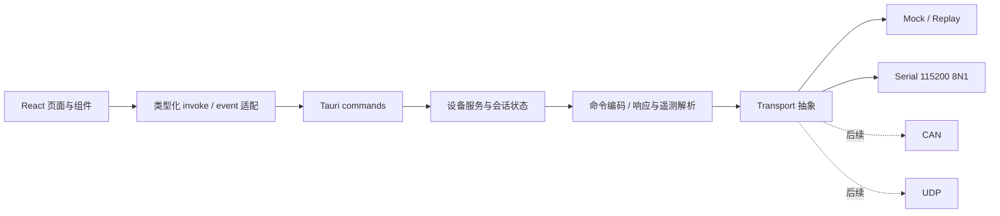

# 系统架构

本文描述多产品上位机的长期边界。产品首页分别进入 WL1 轮腿小车和 GameBox 游戏机工作台，各自拥有协议、会话与页面。WL1 的 feature/framework 固件通过兼容适配器接入，GameBox 独立接收现有只读按键协议；后续串口、CAN 或 UDP 接入应复用对应产品的领域模型，不能把 WL1 的运动命令套用到其他产品。

## 首版落地状态

当前 `0.1.0` 的 WL1 工作台已实现 Tauri 命令边界、单会话设备服务、`Transport` trait、真实串口、Rust/浏览器 Mock、Legacy ASCII 编解码、事件遥测、写入安全锁和后端命令白名单。React 端保存最多 240 个绘图样本；Rust 接收端提供字节流分行、4096 字节失步锁定、连续解析失败阈值和双遥测通道健康超时。

GameBox 新增独立真实串口读取服务、八键诊断工作台、六游戏与六工具图鉴，以及本地 `.bin` 容量/向量/CRC-32 检查。原生和浏览器均可运行明确标记的无硬件演示；只有 Tauri 原生服务访问真实串口。该接口不发送任何探测或控制字节，串口与设备联调仍待实机验证，详见 [GameBox 接入指南](gamebox-integration.md)。

真实串口 writer 与“最后一次实际进入写入临界区的已校验腿高”由 Rust 会话和读取线程共享。故障线程先清除 `alive`，再按 writer → 腿高的统一锁顺序执行安全写入；普通发送在同一 writer 临界区内二次检查 `alive`，因此排队中的非零 `R` 或 `show*-y` 不能越过故障安全帧。故障随后交给独立线程按 `sessionId` 关闭后端会话，即使 WebView 卡死或事件丢失也不影响 Rust 安全收尾。

以下仍是明确的后续接口，而不是已经完成的能力：Replay/CAN/UDP 传输、固件身份握手与动态 capability、参数读回/ACK/持久化、记录文件、固件升级，以及可协商、可验证的固件侧运动看门狗。当前本地工作树仅对有效 `R` 帧实现了 250 ms 超时归零，HEAD 没有；`device_capabilities` 返回的是本机已知的 Legacy 静态描述，不能替代机器人握手。

Legacy 固件只接受文本命令，因此标定页和诊断页仍会把少量受限文本交给统一设备网关；Rust 会再次执行命令名、参数数量、有限值、范围、单行 ASCII 与 32 字节白名单校验。未来版本化协议应把这些入口收敛成结构化 DTO。

## 产品与会话隔离

产品首页负责工作台选择与遗留会话清理，设备通信由各自 Rust 模块持有。返回产品库前关闭当前产品会话，连接生命周期和事件携带 `sessionId`，避免旧连接的迟到数据污染新工作台。WL1 的写入白名单、遥测健康超时和运动收尾属于 WL1；GameBox 不复用这些写命令，也不把没有按键活动判定为遥测超时。

GameBox 的路径为：

```text
GameBox 页面
  → GameBoxGateway
  → gamebox_connect / gamebox_disconnect / gamebox_snapshot
  → 独立 Rust 串口 reader（115200 8N1，只读）
  → gamebox:event + sessionId
  → 启动标识 / BTN 解析、八键状态和日志
```

串口字节在后端按行切分，前端将已知 `FW2` 启动文本和 `BTN` 字段映射为类型化事件，未识别文本保留作诊断。启动文本只表示匹配已知协议标记，没有身份认证或 capability 协商；端口打开、看见启动标记和最近收到事件分别表示不同事实。设备没有屏幕、ADC、I²C 结果或设置回传，因此图鉴及硬件规格属于静态源码说明，不能显示成实时设备读数。

本地固件检查是独立纯数据流程：用户选择 `.bin` 后在主机检查当前应用区大小与 Cortex-M 初始向量，并计算 CRC-32；它不访问串口，也不提供升级权限。当前应用区从 `0x08000000` 开始，占 62 KiB，最后两个 1 KiB 页保留设置。未来固件包管理、分块传输与 bootloader 安装需要新增版本化能力和固件实现，当前不存在对应升级 API。

WL1、GameBox 与 StickS3 共用 `FirmwarePage → firmwareApi → Rust firmware/firmware_image → probe-rs` 的 ST-Link / CMSIS-DAP SWD 通道。WL1 固定 STM32F411CEU / 512 KiB，GameBox 暂定 STM32F103C8T6 / 64 KiB；StickS3 使用独立的 `auto` 目标，先通过 ARM 调试接口读取系列 ID 和容量，再由 `firmware_target.rs` 选择内置 Flash 算法，仅列出 StickS3 USB DAP 探针。自动模式按实测容量读写完整主 Flash；产品配置中的 GameBox 则只写前 62 KiB，读取完整 64 KiB，不开放整片擦除。文件离线解析与连接后的实测容量校验分开，烧录 / 擦除还核对确认时的 UID、系列和容量。全局固件任务与产品会话锁互斥，页面切换保留读取快照，操作中阻止串口重连、返回产品库和正常退出；USB 手动授权设置复用同一任务锁。读取和独立校验结束后恢复此前的核心运行状态，每次操作完成释放 USB。该通道不依赖设备串口下行命令或 bootloader。

外置 SPI Flash 规划用于存储多个包、资源与恢复来源。STM32F103C8 不能直接从普通 SPI NOR 执行代码，每个安装到内部 Flash 的应用仍须符合内部容量；常驻 bootloader 还会减少可用应用区。新布局必须同步主机检查、链接地址、设置保留和断电恢复设计，不能把现在的 62 KiB 检查固定用于未来布局。源码依据和分阶段规划见 [GameBox 接入指南](gamebox-integration.md)。

## 架构目标

- 固件尚未完善时，前端仍可借助 Mock 与记录回放继续开发；
- 页面不接触串口字符串、端口句柄或底层帧；
- 所有可能改变机器人行为的操作在 Rust 边界再次校验；
- 明确区分机器人瞬时状态、当前连接会话和上位机持久偏好；
- 通过版本与能力描述新增功能，不通过散落的固件版本判断堆叠分支；
- 保持单仓库构建，不引入必须另行 clone 的运行时或协议子模块。

## 分层



### React 展示层

展示层负责页面布局、交互状态、图表和用户可理解的错误信息。普通业务功能应使用类型化 DTO 和明确操作，例如“设置腿高”；当前仅诊断与 Legacy 标定保留受限文本入口，且不能绕过设备网关和 Rust 白名单。

建议按业务功能组织，而不是按组件类型堆放：

```text
src/
├── app/                  # 应用壳、导航、全局状态
├── features/
│   ├── connection/       # 端口、连接状态、设备身份
│   ├── telemetry/        # IMU、轮速和趋势
│   ├── tuning/           # PID、legheight 与组合运动目标
│   ├── personalization/  # 仅属于上位机的个性化设置
│   └── diagnostics/      # 日志、原始报文和能力视图
├── lib/                  # Tauri 调用封装与纯工具函数
└── styles/               # 设计令牌、玻璃效果和降级样式
```

### Tauri 命令边界

版本化接口的每条前端调用都应有结构化输入与输出。当前 WL1 Legacy 兼容层额外保留一个受限的 `send_text_command`，其 Tauri command 负责：

1. 检查当前连接会话与设备身份；
2. 检查对应能力是否存在；
3. 对参数做有限值、范围、单位和危险级别校验；
4. 交给协议适配器编码，并再次检查 32 字节上限；
5. 通过传输层发送，关联应答、超时或取消；
6. 返回结构化结果，而不是把任意串口文本直接暴露给页面。

前端校验用于良好体验，Rust 校验才是不能绕过的信任边界。

### 设备服务与会话状态

每个产品的设备服务持有自己的活动连接、协议适配器和事件通道；具有写能力的产品另行管理发送队列和权限。端口句柄不得跨越 Tauri 边界，也不得由多个页面分别打开。

推荐状态机：

```text
Disconnected
  → Opening
  → Identifying
  → ReadyReadOnly / Ready
  → Closing
  → Disconnected

任意活动状态 → Faulted → Closing
```

只有 `Ready` 可以执行写参数；`Identifying`、版本不兼容或能力未知时均保持只读。

### 协议适配层

协议层把领域操作转换为具体固件命令，并把文本/二进制输入转换为结构化数据。现有 feature/framework 文本协议应单独作为“Legacy WL1”适配器，不应污染未来的版本化协议。

协议适配器至少负责：

- 命令名和参数格式；
- 字节级长度计算、结束符与编码；
- 响应关联、超时和固件错误解析；
- `showimu`、`showrpm` 输出的流式切分；
- PID 与 `legheight` 的范围/单位，以及 `R` 四字段运动目标映射；
- 能力映射和只读降级。

### Transport 抽象

Transport 只表达“打开、关闭、写入字节、接收字节、取消”，不理解 PID 或 IMU。

| 实现 | 用途 | 当前策略 |
|---|---|---|
| Mock 会话 | 无硬件界面开发、稳定演示 | 已实现；Tauri 走 Rust 事件链，纯浏览器提供本地预览 |
| ReplayTransport | 回放脱敏的串口记录、复现解析问题 | 未实现；在遥测格式稳定后加入 |
| SerialTransport | WL1 USB / 遥控器桥接 | USB 可选 9600 / 115200；遥控器固定 115200 |
| BluetoothTransport | ZX-D30 BLE UART / WL1 SoftEngine | 原生 btleplug，FFE2 写 / FFE1 通知，20 字节分包、200 ms 帧截止；复用 WL1 会话与命令校验 |
| GameBox 串口 reader | 当前 GameBox FW2 按键诊断 | 已实现独立只读服务；115200 8N1，无写接口，待实机联调 |
| CanTransport | 将来直接访问 CAN/CAN-FD | 仅保留接口，不猜测帧格式 |
| UdpTransport | 将来的网关或无线链路 | 仅保留接口，需另行定义身份与可靠性 |

Mock 不应通过 `if mock` 分支散布到页面。Tauri Mock 与 Serial 经过相同的 Rust 协议、会话状态和事件路径；纯浏览器预览没有 Rust 运行时，只提供经过同一白名单与范围测试约束的轻量模拟，不用于证明串口时序或机械安全。

## 版本化接口与能力协商

固件版本字符串只能用于诊断，不应成为唯一的功能开关。连接结果建议统一为：

```text
DeviceDescriptor
├── identity               # 产品、硬件和固件标识；未知字段允许为空
├── protocolVersion        # major.minor
├── capabilities[]         # 稳定的能力标识
├── limits                 # 已确认的安全范围与命令长度
├── settingsPersistence    # ram / nonvolatile / unknown
└── transport              # serial / mock / can / udp
```

能力标识采用稳定、可组合的名称，例如：

- `telemetry.imu`
- `telemetry.rpm`
- `tuning.pid`
- `geometry.leg-height`
- `motion.composite-target`
- `settings.readback`
- `settings.nonvolatile`

版本规则：

- `major` 不同表示语义或帧格式不兼容，默认只读；
- `minor` 增加只能新增兼容字段或能力；
- 未知字段必须忽略，未知能力不得被自动启用；
- UI 根据能力决定显示、禁用或解释性提示，不根据固件版本散落硬编码；
- 写操作除能力外还必须具有已确认的参数范围和单位。

### 旧固件回退

当前 feature/framework 固件尚未提供稳定的能力查询。兼容流程应保守：

1. 打开串口后不立即写入调参命令；
2. 仅在确认固件存在安全、无副作用的身份查询后才探测；
3. 无法识别时选择显式的“Legacy WL1”配置，而不是猜测；
4. 该配置只暴露已通过源码和实机共同确认的命令；
5. 不向旧固件自动发送未来设计的 `getcaps` 等未知命令，因为未知解析行为尚不确定；
6. 用户切换兼容配置或启用危险能力时保留审计记录。

## 三类状态的所有权

| 状态 | 示例 | 保存位置 | 生命周期 |
|---|---|---|---|
| 设备瞬时状态 | IMU、RPM、当前 PID | 机器人 RAM / 会话镜像 | 断电或重启可能丢失 |
| 会话状态 | 当前端口、协议适配器、流订阅 | Rust 内存 | 断开即清理 |
| 上位机偏好 | 主题、面板布局、收藏参数方案 | 应用配置目录 | 可跨会话保留 |

界面必须避免用同一个“保存”描述不同状态。建议使用“应用到本次运行”“保存为上位机方案”和未来可能出现的“写入设备非易失存储”三个不同动作。当前 WL1 调参仅在 RAM 中生效，不能显示为已永久保存；GameBox 虽在设备内保存自身设置，上位机没有对应读写接口，本地固件检查也不代表文件已经存入设备。

## 遥测数据流

`showimu -y` 会产生约 100 Hz 的姿态 CSV（HEAD 三字段；当前工作树追加 `a/ok`），`showrpm -y` 会产生约 20 Hz 的 A/B 轮速文本；对应 `-n` 命令停流。为避免阻塞 UI：

- 串口读取在后台任务执行；
- 解码器维护有界缓冲并处理半包、多包和异常字节；
- 解码器处理每一行，但向 WebView 的结构化遥测事件限制在 20 Hz，与图表刷新率一致；
- 每个连接生成不可复用的 `sessionId`；遥测、日志、掉线和写请求都携带它，迟到的旧会话事件不得污染或关闭新连接；
- WebView 启动或全量刷新时先安装事件监听，再无条件要求 Rust 关闭遗留会话并尝试发送中立帧；安全初始化完成前不开放连接操作；
- 高频数据进入固定容量环形缓冲，页面绘制采用限频后的快照；
- 慢消费者不得反压串口读取任务；超限数据应丢弃旧样本并增加计数；
- 高频 IMU/RPM 行不逐条复制到 React 终端；未来原始记录器应使用独立后端通道；
- IMU 与 RPM 各自携带最后更新时间；UI 分通道在 600 ms 后隐藏陈旧值，不能让仍活跃的 IMU 把旧 RPM（或反向）伪装成新样本，也不把端口存活等同于遥测健康；
- 断开连接后所有订阅和后台任务必须可取消并完成回收。

在 115200 baud 下不能假定所有遥测都能无限频率同时输出。实际采样率、行长度和带宽预算必须在台架上测量。

## 错误模型

错误至少分为以下类别，便于页面给出可执行建议：

- `Transport`：端口不存在、权限不足、拔出、读写失败；
- `Timeout`：命令未确认或遥测中断；
- `Protocol`：行过长、字段缺失、编码或校验失败；
- `Unsupported`：设备没有对应能力；
- `Validation`：参数越界、非有限数、命令超过 32 字节；
- `SafetyInterlock`：未满足写操作安全条件；
- `DeviceRejected`：固件明确拒绝命令；
- `Internal`：无法归类的软件错误。

面向用户的消息使用中文并给出下一步；诊断详情保留稳定错误码和脱敏上下文。不要在日志中记录个人路径、凭据或无限量原始数据。

## 安全与权限边界

- Tauri capabilities 只授予应用实际需要的命令与插件权限；
- 不开启通用 shell 执行，不允许前端传递任意命令名；
- 危险操作使用显式 allowlist 和结构化参数；
- 所有数值拒绝 `NaN`、无穷大和单位不明确的输入；
- 通信断开时停止发送并将 UI 置为未知状态，不能保留“已安全停止”的假象；
- 运动安全最终必须由固件看门狗、限位、限流和物理急停保证。

详细操作要求见[安全指南](safety.md)。

## 测试边界

- 前端：纯函数、参数表单、能力驱动显示和状态转换；
- 协议：命令长度边界、数值格式、半包/粘包、乱码、异常行和黄金样本；
- Transport：Mock 的延迟、超时、拔出和乱序场景；
- Tauri command：无能力、只读状态、范围错误和取消；
- 硬件台架：真实串口格式、参数单位、上下限、掉线与急停恢复。
- GameBox：真实启动文本和八键事件、只读串口、拔线重连、旧会话隔离；本地固件容量与向量异常、CRC-32；外置 Flash 与升级恢复仍属后续独立验证范围。

实机测试不能被 Mock 测试替代，Mock 也不应声称证明了机械安全。
